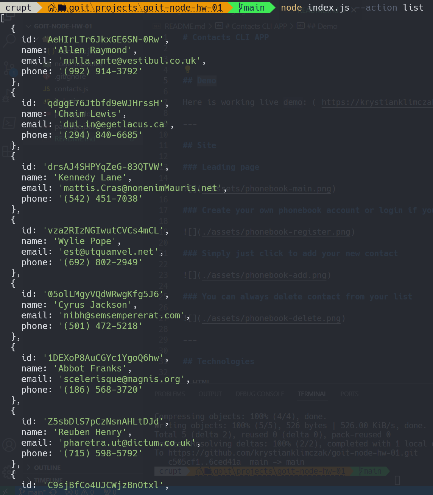

# Contacts CLI APP

---

## DEMO

### node index.js --action list

### node index.js --action get --id 05olLMgyVQdWRwgKfg5J6

### node index.js --action add --name Mango --email mango@gmail.com --phone 322-22-22

### node index.js --action remove --id qdggE76Jtbfd9eWJHrssH

---

## Technologies

- Node.js
- JavaScript

---

## Setup

Clone this repo to your desktop and run `npm install` to install all the dependencies.

---

## Usage

After you clone this repo to your desktop, go to its root directory and run `npm install` to install
its dependencies.

Once the dependencies are installed, you can run:

- list : `node index.js --action list`
- find by id : `node index.js --action get --id CONTACT_ID`
- add : `node index.js --action add --name NAME --email EXAMPLE@EMAIL.COM --phone 322-22-22`
- remove : `node index.js --action remove --id CONTACT_ID`

---

## Feel free to share your opinion

- https://www.linkedin.com/in/klima96/
